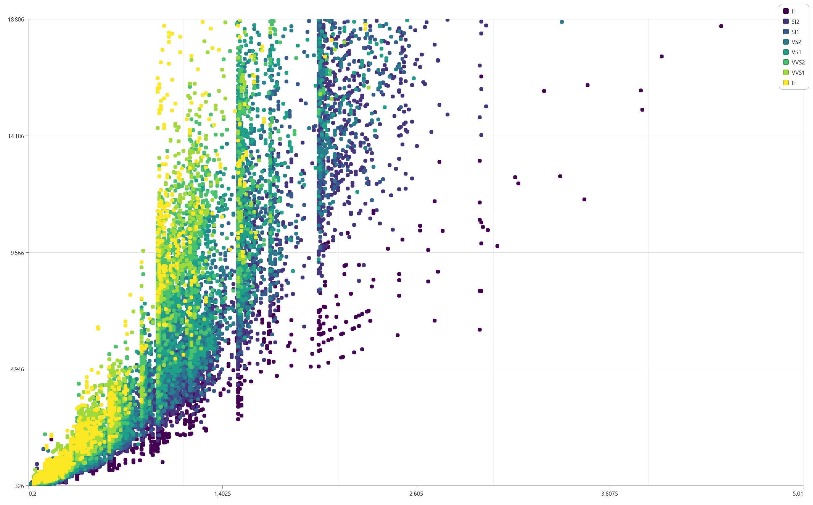

# rchartgpu

<!-- badges: start -->
[](https://lifecycle.r-lib.org/articles/stages.html#experimental)
<!-- badges: end -->

R Htmlwidget for [ChartGPU](https://github.com/ChartGPU/ChartGPU) : ChartGPU is a TypeScript charting library built on WebGPU for smooth, interactive rendering—especially when you have lots of data. See [ChartGPU Examples](https://chartgpu.github.io/ChartGPU/examples/) for more.


## Installation

You can install the development version of rchartgpu from [GitHub](https://github.com/dreamRs/rchartgpu) with:

```r
# install.packages("pak")
pak::pak("dreamRs/rchartgpu")
```


## Line Chart

Here's a time series in hourly steps over 14 years (2012 - 2026), representing a total of 2,482,560 points (10 series of 248,256).

```r
library(rchartgpu)
chartgpu(eco2mix) # for dataset see data-raw/eco2mix.R
```


## Scatter Chart

```r
library(rchartgpu)
scattergpu(
  data = ggplot2::diamonds,
  mapping = aes(x = carat, y = price, color = clarity)
) |>
  chartgpu_theme_light(palette = scales::viridis_pal(option = "viridis")(8))
```

